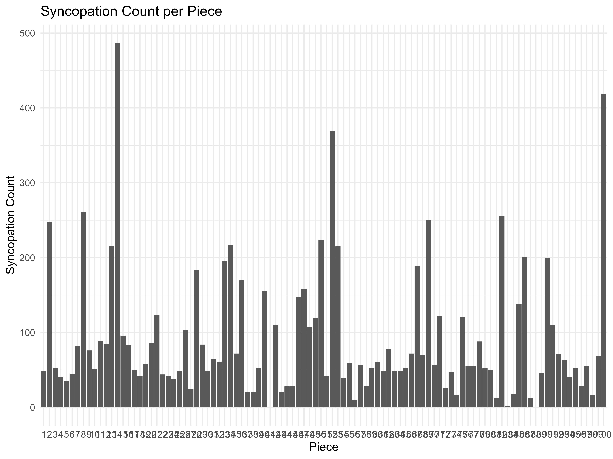
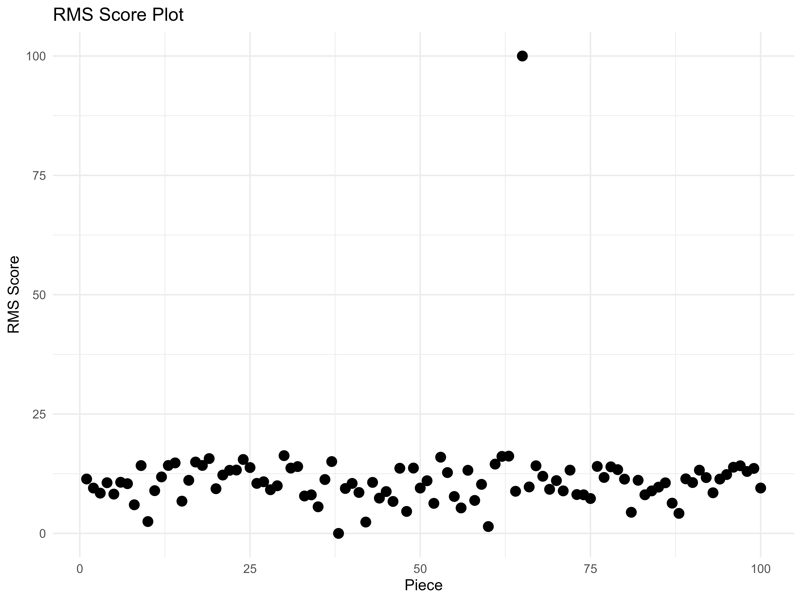
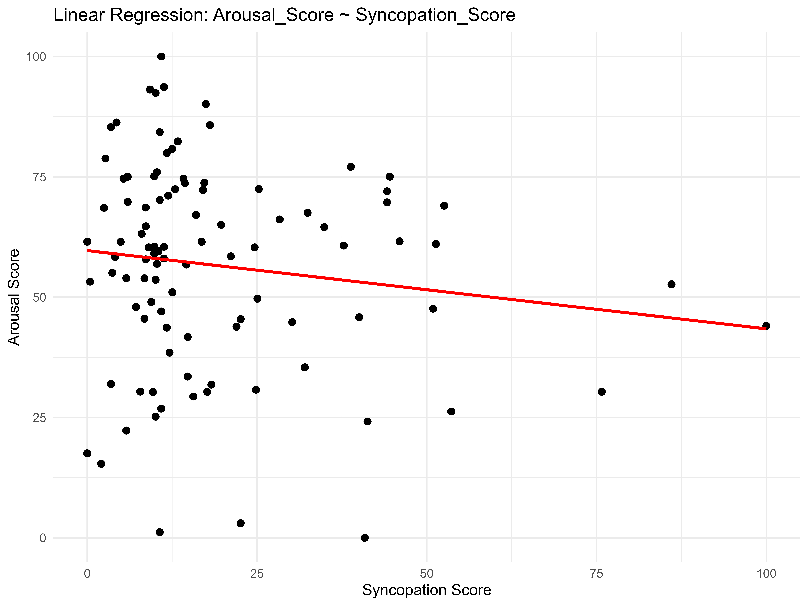
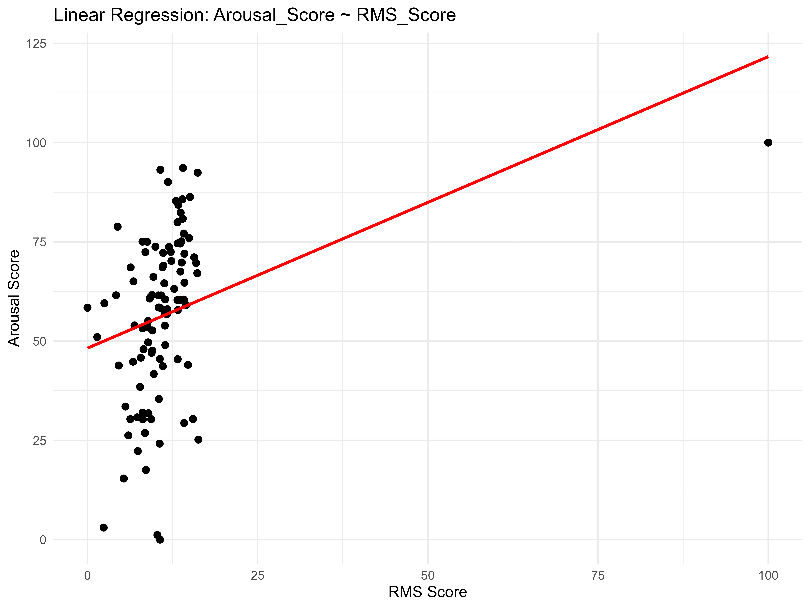
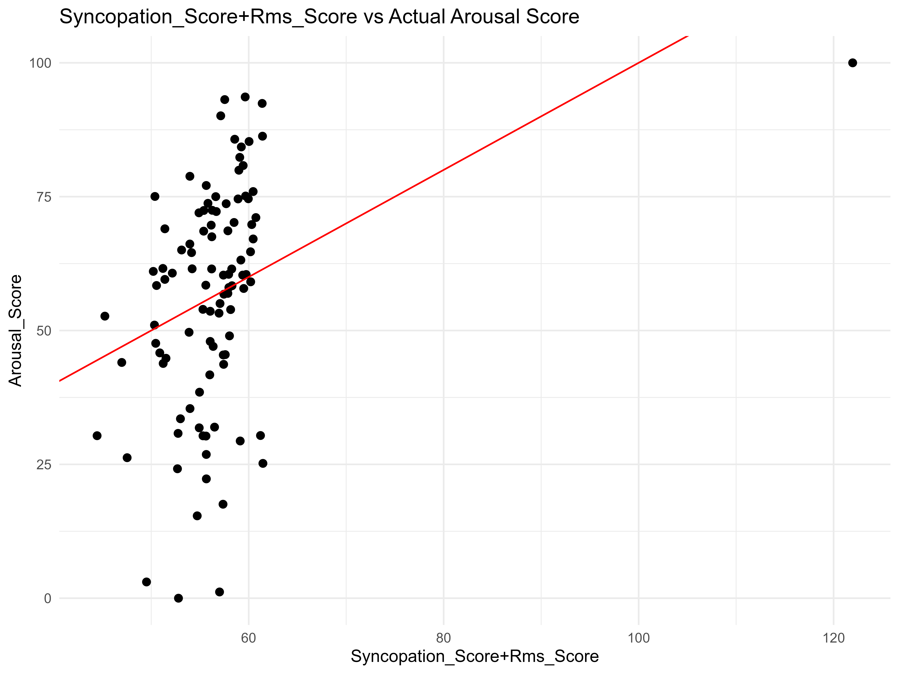

# Exploring-the-Influence-of-Syncopation-and-Loudness-on-Listener-Arousal-in-Music

**Examine the individual and combined effects of synco-pation and loudness on listener-reported arousal**

## Introduction ##
Music is a powerful tool for evoking emotions, capable of influencing mood, phys-iological states, and even behavior. Arousal, one of the primary dimensions of emo-tional response, reflects the intensity or energy level of an experience and is shaped by various musical features. Understanding the mechanisms behind arousal in music not only deepens our comprehension of human emotional processing but also has practical applications in fields such as music therapy, entertainment, and artificial intelligence-driven music composition. In this research, using syncopation and loudness to analyze arousal.
- **Syncopation**: Syncopation, marked by rhythmic irregularities and disruptions of expected patterns, evokes excitement and emotional tension by challenging the listener's predictive models (Huron & Ommen, 2006; 
                   Tan et al., 2019). Its impact on arousal depends on context and familiarity, with moderate syncopation often bringing more enjoyment than very low or high levels, supporting optimal complexity 
                   theories (Gómez et al., 2005).
- **Loudness**： Loudness, measured by RMS levels, strongly influences arousal, with louder music perceived as more intense and engaging, triggering heightened physiological and emotional responses (Hosken et al., 
                 2021). Unlike syncopation, it serves as a direct cue, consistently correlating with arousal across styles and listeners.
  
## Research Question and Hypothesis ##
### Question ###
- Does higher syncopation evoke greater arousal in listeners?
- Does increased loudness correlate with higher arousal levels?

### Hypothesis ###
- More syncopation within vocal parts evokes higher levels of arousal in listeners.
- Higher RMS levels (representing loudness) lead to increased levels of arousal.

## Method ##
### Datasets ###
- [](https://github.com/Computational-Cognitive-Musicology-Lab/CoCoPops/tree/main/Billboard/Data)

- Filter ```*.varms.hum```: [](Datasets/CoCopops%20we%20will%20use/)

### Installation ###
- **Prerequsites**

  [](https://www.r-project.org/)
  [](https://posit.co/)

- **HumdrumR Installation**
```
install.packages('devtools')
devtools::install_github("Computational-Cognitive-Musicology-Lab/humdrumR")
git clone https://github.com/Computational-Cognitive-Musicology-Lab/humdrumR
devtools::install()
library(humdrumR)
```
### Key Features ###

🎶 **Syncopation Score** 
 - A measure of rhythmic complexity
 - Calculated as the normalized count of syncopations within vocal parts for each piece

🔊 **RMS Score**
 - Represents loudness
 - Computed as the average RMS value extracted from the ```**rms``` spine of each piece.

😊⚡ **Arousal Score** 
 - An overall mean value of each piece derived from listener-reported arousal levels in the ```**arousal``` spine.

🎶🔊**Combined RMS and Syncopation Score**
 - A composite score that integrates both RMS and syncopation metrics.

 ### Procedure ###

- **Load library**
  ```
   library(humdrumR)
   library(ggplot2)
   library(dplyr)
   library(tidyr)
  ```
- **Load Files**
  ```
  readHumdrum('./.*hum')->Cocopops
  ```
- **Calculating Syncopation Scores**
  - Analyze the syncopation of each piece. First, obtain the duration of each piece and convert them into numerical values. Group the data according to the 
    "Piece".
  ```
   dur_values <- Cocopops|>
       group_by(Piece) |>
       mutate(Duration = as.numeric(as.character(duration(Token)))) |>
   ungroup()
  ```
  
  - Using “syncopation(dur, meter = duple(5), levels = “all”, groupby = list())” in HumdrumR  to access songs in 4/4 time and obtain syncopations. The result is 
    true and flase. True represents syncopations, and flase does not.
    ```
    Synco <- dur_values |>
      group_by(Piece) |>
      summarise(Syncopation = list(syncopation(Duration, meter = duple(5), levels = "all", groupby = list())))
    ```

  - Calculate the number of “true” in each piece, that is, the number of syncopations, and use “geom_col” in “ggplot” to plot a bar chart about piece and 
    Syncopation_Count.
    ```
    results <- Synco |> 
               mutate(Syncopation_Count = sapply(Syncopation, function(x) sum(x)))
    ggplot(results, aes(x = as.factor(Piece), y = Syncopation_Count)) +
               geom_col() +
               labs(title = "Syncopation Count per Piece", x = "Piece", y = "Syncopation Count") + theme_minimal()
    ggsave("plot.jpg", width = 8, height = 6, dpi = 800)
    ```
    
    
  - Syncopation score for each piece is calculated by taking the Syncopation_Count statistics for all 100 pieces, arranging all the data from smallest to largest, and normalizing to [0,100] to obtain the 
    corresponding score, and make all Syncopation_Score as scatter plots.
    
    ```
    min_valueS <- min(results$Syncopation_Count)
    max_valueS <- max(results$Syncopation_Count)
    S_Score_list <- results |> 
    mutate(Syncopation_Score = (results$Syncopation_Count - min_valueS) / (max_valueS - min_valueS) * 100)

    print(S_Score_list$Syncopation_Score)
    ggplot(S_Score_list, aes(x = Piece, y = Syncopation_Score)) +
        geom_point(color = "black", size = 3) +
        labs(
          x = "Piece", 
          y = "Syncopation Score", 
          title = "Syncopation Score by Piece"
        )
    ggsave("Syncopation Score.png", width = 8, height = 6, dpi = 800)
    ```
    

 - **Calculating RMS Scores**
   - Design a function (RMS)that calculates the average of the total rms value of all rows in each song.First, the data in the **rms spine of the corpus is filtered, and the remaining spine is removed, grouping 
     each piece. Second,Convert humdrum format to data.frame. Load all rms values into col1 and ensure that all data is numeric. Calculate the average of all values in col1, which is the average rms value of the 
     piece.
     ```
     RMS<- function(data) {
           data |>
           filter(Exclusive == "rms") |>
           group_by(Piece, Bar) |>
           removeEmptySpines() |>
           as.data.frame() |>
           separate(V1, into = "Col1", sep = " ") |>
           mutate(Col1 = as.numeric(Col1)) |>
           summarise(mean_col1 = mean(Col1, na.rm = TRUE)) |>
           ungroup()
     }
     ```
   - Iterate 100 pieces and calculate the rms mean value of all the songs.(Because using “as.data.frame” to calculate the mean causes the “group_by(Piece,Bar)” function in HumdrumR to be broken, if the input is 
     the entire Cocopops corpus, the result is the unique mean of all pieces and all phrases.) Extract the rms average of all pieces and write them to a list, convert to a data frame, and finally visualize them.
     ```
     RMS_list<- list()
     for (i in 1:100) {
        RMS_result <- RMS(Cocopops[i])
        RMS_list[[i]] <- RMS_result$mean_col1
      }
      mean_col1_list <- lapply(RMS_list, function(x) as.numeric(x))

      # Convert to data frame
      mean_col1_df <- data.frame(mean_col1 = unlist(mean_col1_list))

      # View results and visualization
      print(mean_col1_df )

      ggplot(mean_col1_df, aes(x = seq_along(mean_col1), y = mean_col1)) +
      geom_point(size = 2, color = "black") 
     labs(
        x = "Piece", 
        y = "RMSValue", 
        title = "RMSValue by Piece"
       ) +
       theme_minimal()
     ggsave("RMSValue.png", width = 8, height = 6, dpi = 800)
     ```
   - For subsequent correlation analysis, we also normalized the average rms value of all pieces from small to large to 0-100 as the rms score of each song and visualize them.
     ```
     min_value_means_col1 <- min(mean_col1_df$mean_col1)
     max_value_means_col1 <- max(mean_col1_df$mean_col1)
     Rms_Score = (mean_col1_df$mean_col1- min_value_means_col1) / (max_value_means_col1 - min_value_means_col1) * 100
     Rms_Score_df <- data.frame(Piece = seq_along(Rms_Score), Rms_Score = Rms_Score)
     ggplot(Rms_Score_df, aes(x = Piece, y = Rms_Score)) +
         geom_point(size = 3, color = "black") +  
         labs(
           x = "Piece", 
           y = "RMS Score", 
           title = "RMS Score Plot"
         ) +
         theme_minimal()
     ggsave("RMS Score.png", width = 8, height = 6, dpi = 800)
     ```
     
     
- **Calculating Arousal Score of each piece**
  - Design a function (AROUSAL)that calculates the average of the total arousal value of each piece.Since the arousal values come from four people, but in the corpus the four values are in one column, the average score for each phrase cannot be calculated. Therefore, 
    the **.hum file must first be converted into a data frame, and then the data of one column  from four people into four columns of data from one person, so that the average of the four columns of data can be calculated as the arousal value of each musical phrase 
    of a piece. Admittedly, participants did not give scores to some musical phrases, so all “None” were changed to 0.Finally, the arousal value of each musical phrase was summed and then averaged to be used as the arousal value of the entire piece.
    ```
    AROUSAL <- function(data) {
      average_result <- data |>
      filter(Exclusive == "arousal") |>
      group_by(Piece, Bar) |>
      removeEmptySpines() |>
      as.data.frame() |>
      separate(V1, into = c("Col1", "Col2", "Col3", "Col4"), sep = " ") |>
      mutate(across(starts_with("Col"), ~ replace_na(as.numeric(.), 0))) |>  # Replace NA with 0
      rowwise() |>
      mutate(row_mean = mean(c_across(starts_with("Col")), na.rm = TRUE)) |> # Calculate the average of the rows
      ungroup()
  
    overall_mean <- average_result |>
      summarise(overall_row_mean = mean(row_mean, na.rm = TRUE))  # Calculate the overall average
  
    return(list(average_result = average_result, overall_mean = overall_mean))
    }
    ```
  - Iterate 100 pieces and calculate the arousal mean value of all the pieces.(Because using “as.data.frame” to calculate the mean causes the “group_by(Piece,Bar)” function in HumdrumR to be broken, if the input is the entire Cocopops corpus, the result is the unique 
    mean of all pieces and all phrases.)
    ```
    AROUSAL_list <- list()
    for (i in 1:100) {
      AROUSAL_result <- AROUSAL(Cocopops[i])
      AROUSAL_list[[i]] <- AROUSAL_result$overall_mean
    }
    ```
  - Extract the average arousal value(overall_row_mean) of all pieces and write them to a list, convert to a data frame, and finally visualize them.
    ```
    overall_mean_list <- lapply(AROUSAL_list, function(x) as.numeric(x$overall_row_mean))
    overall_mean_df <- data.frame(overall_mean = unlist(overall_mean_list))

    print(overall_mean_df)
    ggplot(overall_mean_df, aes(x = seq_along(overall_mean), y = overall_mean)) +
      geom_point(color = "blue", size = 3) +
      labs(x = "Index", y = "Overall Mean", title = "Scatter Plot of Arousal Value") +
      theme_minimal()
    ```
  - For subsequent correlation analysis, we also normalized the average arousal value(overall mean) of all pieces from small to large to 0-100 as the arousal score of each song and visualize them.
      ```
      min_valueA <- min(overall_mean_df$overall_mean)
      max_valueA <- max(overall_mean_df$overall_mean)
      A_Score_list <- overall_mean_df |> 
         mutate(Arousal_Score = (overall_mean_df$overall_mean - min_valueA) / (max_valueA - min_valueA) * 100)

       print(A_Score_list$Arousal_Score)

      ggplot(A_Score_list, aes(x = seq_along(Arousal_Score), y = Arousal_Score)) +
           geom_point(size = 3, color = "black") +
           labs(
                x = "Piece", 
                y = "Arousal Score", 
                title = "Arousal Score Per Piece"
               ) +
                theme_minimal()
      ggsave("Arousal Score.png", width = 8, height = 6, dpi = 800)
      ```
   

### Results ###
- The correlation between syncopation score and arousal score（[Code: Line 205-248](/code.Rmd#L205))

  
  
  We employed a multiple linear regression model to examine the relationship between the Syncopation score and the Arousal score. The analysis revealed a  negative 
  relationship (coefficient = -0.1626, p = 0.1711), with minimal variance explained (R² = 0.01903), which suggests that as the syncopation score increases, the arousal score tends 
  to decrease, contrary to hypothesis.

- The correlation between RMS score and arousal score（[Code: Line 250-288](/code.Rmd#L250))
   
  
   RMS scores positively correlated with arousal (coefficient = 0.7341, p = 0.000719). The positive slope in the multiple linear regression model (Fig. 6) indicates that as RMS score 
   increases, arousal score also increases, supporting our hypothesis. Although the coefficient between RMS Score and arousal score is greater than 0, the R² value is only 0.1107, which 
   means that the relationship between the two is not convincing.

- Combined Analysis([Code: Line 289-328](/code.Rmd#L289))
  
  
  While examining the relationships between our variables, we created a new com-bined variable integrating the Syncopation and RMS scores to assess its correlation with the Arousal Score. 
  Based on the syncopation coefficient of -0.1487 and the RMS coefficient of -0.7242, the overall coefficient is still greater than 0, and the relationship between the independent variable 
  and the dependent variable is still positively corre-lated. Compared to the effect of the RMS score on the arousal score alone, the R-squared increases to 0.1266, which means that after 
  combining the syncopation score,the variable factors that affect the arousal score are more convincing

  

  


